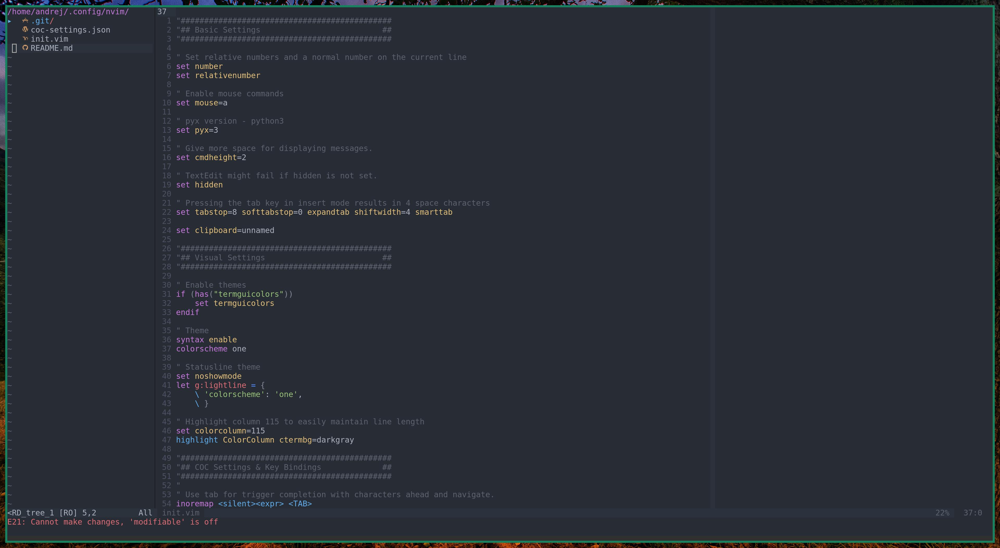

# Andrej's NeoVim Config


## Features
- [Vim One](https://github.com/rakr/vim-one) dark theme with [Lightline](https://github.com/itchyny/lightline.vim) statusbar
- [COC](https://github.com/neoclide/coc.nvim) intellisense with support for different programming languages
- [NERDTree](https://github.com/preservim/nerdtree) with [devicons](https://github.com/ryanoasis/vim-devicons)
- [FZF](https://github.com/junegunn/fzf.vim) file search
- Live preview for Latex ([Vimtex](https://github.com/lervag/vimtex))

## How to use
Put the files in ```.config/nvim/``` and run:
```bash
nvim +PlugInstall
```

## Other
A huge help with setting this up was [this](https://medium.com/better-programming/setting-up-neovim-for-web-development-in-2020-d800de3efacd) blogpost, which I encourage you to check out!
